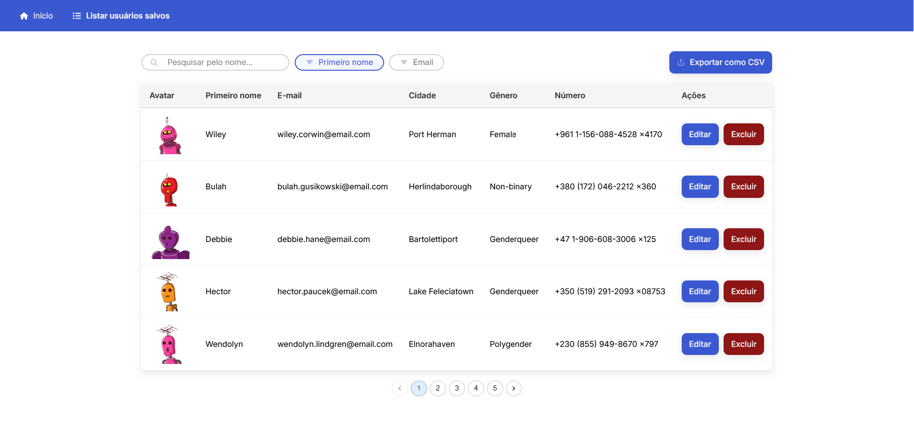
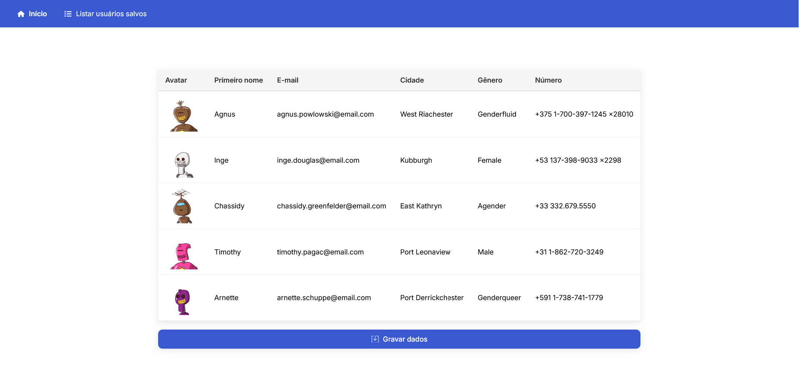
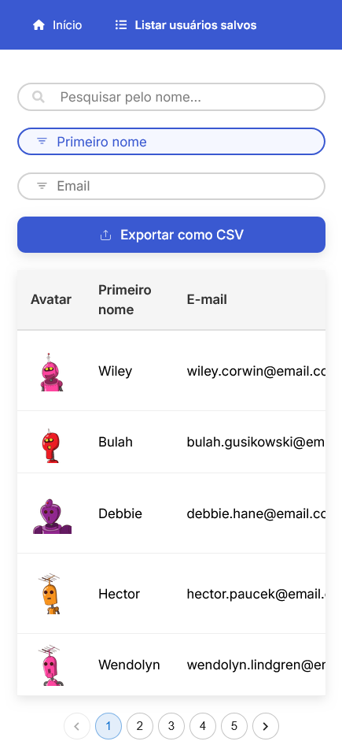

# 📚 App Fullstack com Express e React

Aplicativo Fullstack desenvolvido em **React + TypeScript + Vite + TailwindCSS** (Client) e **Express.js** (Server), para gerenciar usuários obtidos da API [random-data-api](https://random-data-api.com/documentation).

---

## 📷 Previews

Imagens de demonstração do aplicativo:

<div align="center">
  
  
  
</div>

---

## 🏧 Estrutura do Projeto

```
/
├── client/my-app   # Front-end React
├── server/    # Back-end Express
```

---

## ✨ Funcionalidades

- **Listagem de usuários** obtidos via [random-data-api](https://random-data-api.com/documentation).
- **Salvar usuários** em um arquivo **CSV** interno.
- **Editar** e **excluir registros** já gravados no CSV, mantendo a integridade do arquivo.
- **Pesquisa** baseada em pelo menos dois campos do CSV.
- **Adicionar novos dados** a qualquer momento via menu.
- **Atualizações dinâmicas** da lista de usuários após operações.
- **Responsividade** para todos os dispositivos.
- **Exportar** usuários salvos para download como arquivo CSV.
---

## 🚀 Tecnologias Utilizadas

### Front-end (Client)
- [React](https://react.dev/)
- [TypeScript](https://www.typescriptlang.org/)
- [Vite](https://vitejs.dev/)
- [TailwindCSS](https://tailwindcss.com/)

### Back-end (Server)
- [Node.js](https://nodejs.org/)
- [Express.js](https://expressjs.com/)
- Manipulação de arquivos CSV com Node.js (fs)

---

## ⚙️ Como Rodar o Projeto

### 1. Clone o repositório
```bash
git clone https://github.com/JuanGabriel-SA/teste-logica.git
cd teste-logica
```

### 2. Instale as dependências

#### No servidor (Express):
```bash
cd server
npm install
```

#### No cliente (React):
```bash
cd ../client/my-app
npm install
```

### 3. Execute os servidores

#### Rodar o servidor Express:
```bash
cd server
npm run dev
```

#### Rodar o cliente React:
```bash
cd ../client/my-app
npm run dev
```

---

## 📄 Estrutura de Arquivos CSV

- Um único arquivo `.csv` é utilizado para armazenar todos os usuários.
- Ao editar ou excluir um registro, **a posição dos outros registros é preservada**.

---

## 🔍 Funcionalidade de Pesquisa

A pesquisa permite:
- Buscar usuários com base em **nome** e **e-mail**.

